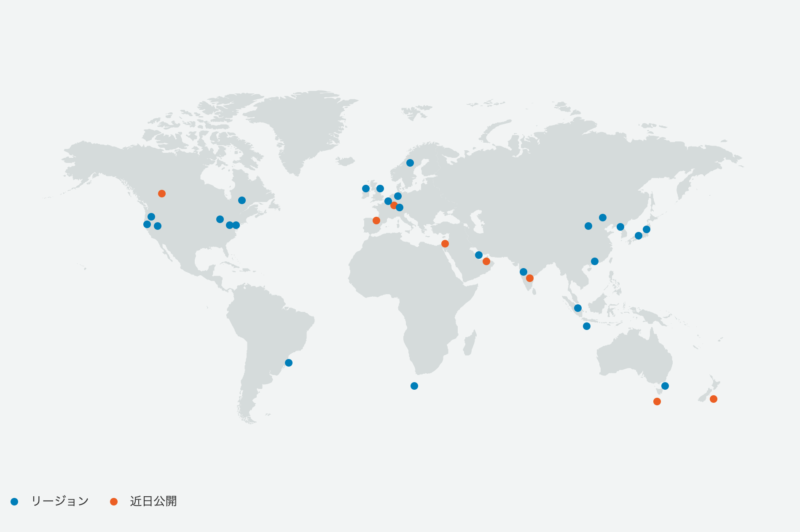
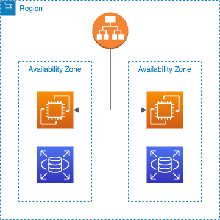

# リージョンとアベイラビリティゾーン

## リージョン

- AWSがサービスを提供している国や地域のこと。

- リージョン同士は地理的に離れている。

> 画像: [AWS グローバルインフラストラクチャ | AWS](https://aws.amazon.com/jp/about-aws/global-infrastructure/)

## アベイラビリティゾーン（AZ）

- リージョン内に含まれる複数のデータセンターの集まりのこと。
- AZは、地理的・電源的に独立した場所に配置されている。
  - 自然災害による障害に対し、別のAZに影響がないように離れた場所に配置されている。
  - 独立した場所に配置されているが、各AZ間は高速なネットワーク回線で接続されているため遅延はほぼない。

### マルチAZ

- 耐障害性を高め、システムの可用性を高めるために1つのAZのみでシステム構築するのではなく、複数のAZにシステムを構築すること。

    

> 画像: マルチAZ例
> 
> - ALBから2つのAZにそれぞれ配置されたEC2インスタンス(Webサーバー)に負荷分散させている。

